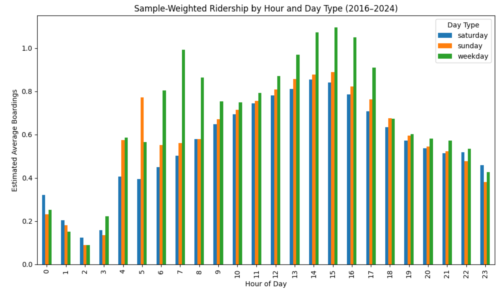
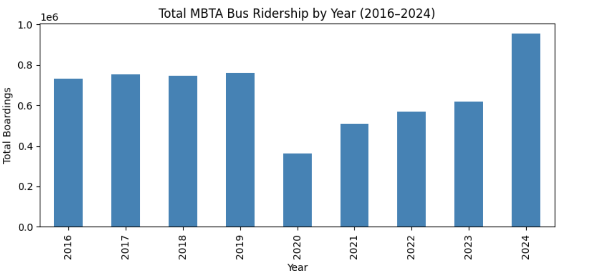
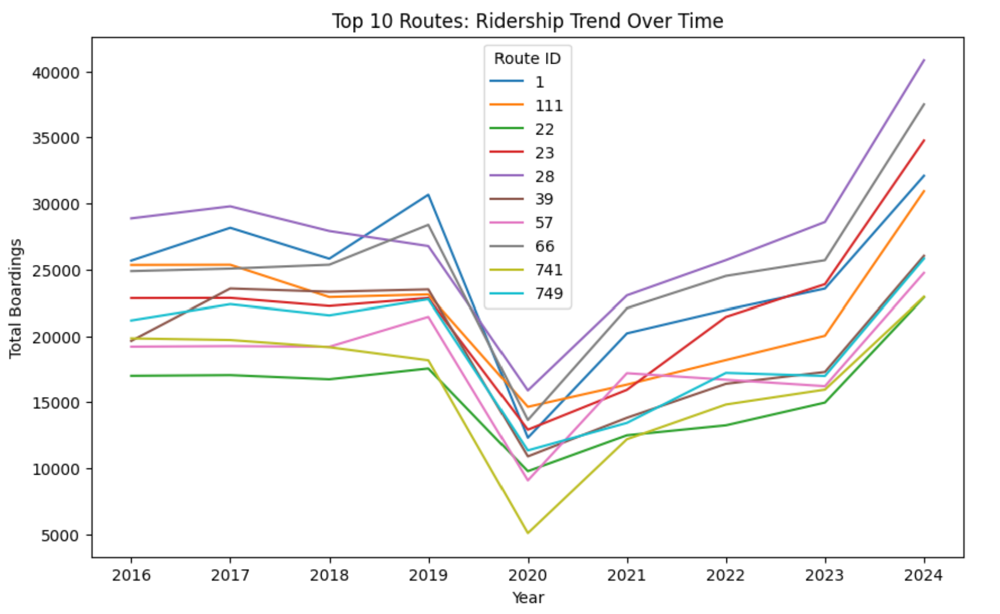
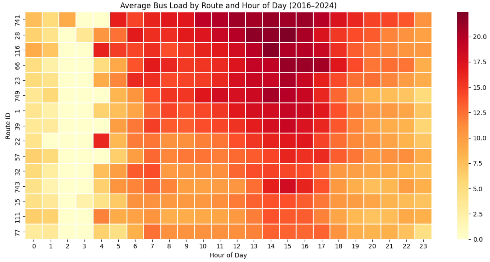
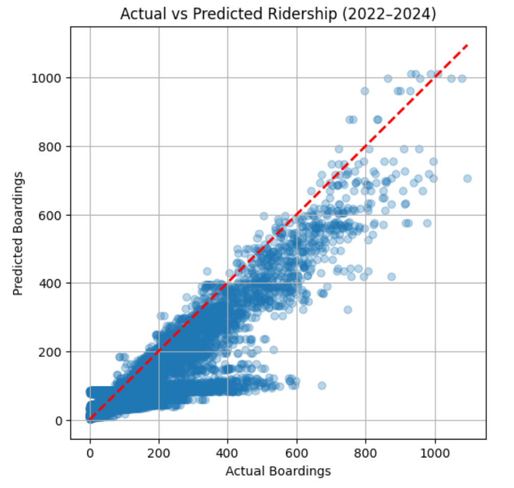
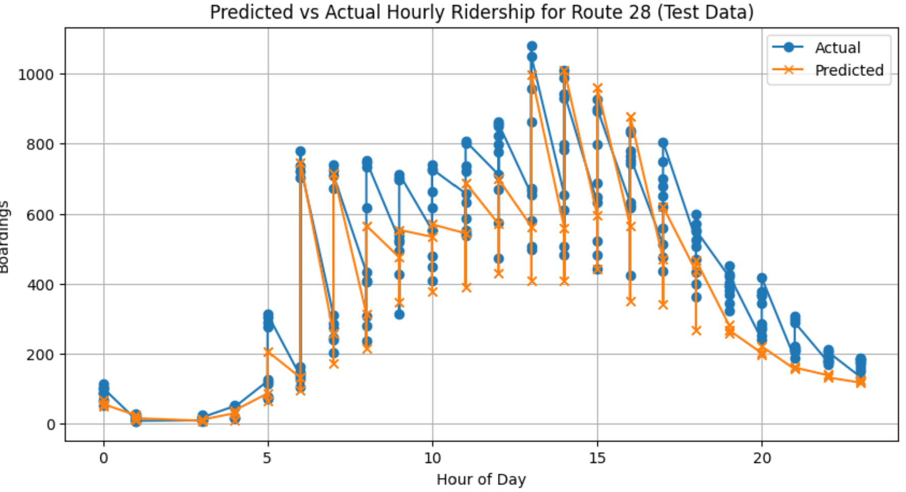
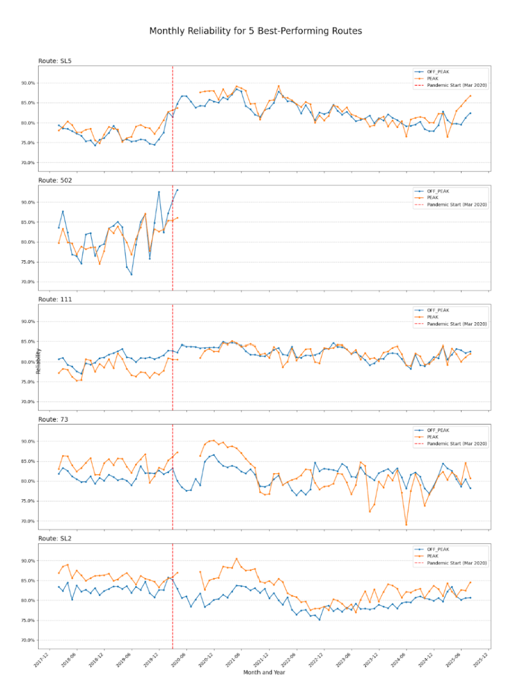
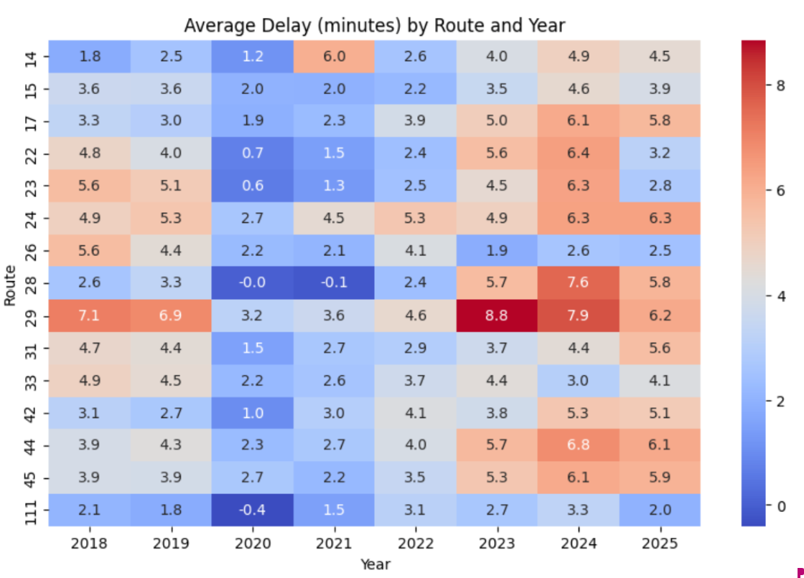

# Boston Bus Equity Project

video link: https://www.youtube.com/watch?v=CNgK63r3PCk

**Description of the project.**

This project aims to analyze disparities in bus service performance and equity in the city of Boston using MBTA ridership, reliability, and passenger service data, focusing on delays and excess trip time. We will use operational features, such as routes, schedule vs. actual times, ridership levels, etc. and demographic features such as race, car access, age, and income (from ACS Census Data) to predict the likelihood of trip delays. We are primarily focused on predictive modeling (classification/regression). We want to identify which communities within Boston are most disproportionately affected by potentially unreliable service as well as forecast ridership volume and delay for future bus routes.

---

## **Ridership Data**

Datasets: Using ridership data collected from:  
https://mbta-massdot.opendata.arcgis.com/datasets/7acd353c1a734eb8a23caf46a0e66b23_0/explore

Data contains ridership information from 2016–2024, seasons: Fall (all years) (spring 2024 only).

---

### **Key visual Findings: combining_data.ipynb**

<figure style="text-align:center;">
  
  <figcaption>Hourly demand cycles clearly show AM (~7–9 AM) and PM (~3–6 PM) commuter peaks.</figcaption>
</figure>

<figure style="text-align:center;">
  
  <figcaption>Pandemic impact: Systemwide ridership collapsed in 2020–2021 and has recovered by 2024.</figcaption>
</figure>

<figure style="text-align:center;">
  
  <figcaption>Top 10 routes dominate overall ridership, especially routes serving transit-dependent neighborhoods.</figcaption>
</figure>

<figure style="text-align:center;">
  
  <figcaption>Crowding heatmap (avg onboard load) reveals persistent peak-hour congestion on core parts (Routes 28, 66, 1).</figcaption>
</figure>

---

## **Predictive Modeling Methods** (So Far): predictve_ridership.ipynb

Built a baseline ridership forecasting model, using:

- Model Type: Random Forest Regressor (why? handles nonlinear patterns, robust to noise as opposed to single decsiion tree)
- Features: route_id, hour, day_type_name, season, year
- Target: boardings (aggregate per route-hour-season-year)
- Preprocessing: OneHot encoding of categorical variables (used Pipeline + ColumnTransformer in SKlearn)
- Train/Test Split: Chronological split → Train = 2016–2021, Test = 2022–2024

**Key Insights:**
- Ridership is highly predictable using only temporal + route features.
- The model generalizes well to post-pandemic years.
- MAE: 40.011344986012304
- R²: 0.7489096543835372

<figure style="text-align:center;">
  
</figure>

<figure style="text-align:center;">
  
</figure>

---

**What have we learned so far?**

There is enough signal in the features to predict ridership volume for the post pandemic years. This baseline model explains ~75% of the variability in the target–indicating that the structure of our data is learnable and generalizable. 

---

**Limitations and Next Steps:**

The current graph models total boardings per route per hour across ALL stops–good for macro-level ideas but not enough for stop level equity and noise. 

Future modeling target: combine boardings per stop, delay per stop, load per stop, and demographics to answer the question:  
**P(delay > X) at Stop a, hour=7AM, weekday, Route 28**

---

## **Reliability Data**

<h3><u>Data Processing:</u></h3>

The initial analysis was performed on the "MBTA Commuter Rail, Bus, Rapid Transit Reliability" dataset. The goal of our processing was to isolate a clean, analysis-ready dataset focused specifically on bus service reliability for the period relevant to our project (2018-present).

In the context of this project, reliability is one of the most important metrics to determine service quality. 

**Reliability Metric:** percentage of observed bus trips that were both on time (schedule adherence) and properly spaced (headway). 

---

The following processing pipeline was executed:

- <u>Data loading</u>: The raw CSV data was loaded into a pandas DataFrame.

- **Mode filtering:** The dataset was filtered to retain only records where the mode_type was 'Bus'. All 'Rail' and 'Commuter Rail' data was discarded.

- **Time filtering:** The data was filtered to include only records where the service_date was on or after January 1, 2018, establishing our pre- and post-pandemic analysis window.

- **Handling missing values:**
  - ‘cancelled_numerator’: Null (NaN) values in this column were filled with 0, based on the assumption that a missing value indicates zero observed cancellations for that service block.
  - ‘otp_numerator / otp_denominator’: Rows with null values in either of these essential columns were dropped, as reliability cannot be calculated without them.

- <u>Feature Engineering (Reliability Metric)</u>:  
  The primary dependent variable, reliability_metric, was engineered by dividing otp_numerator by otp_denominator.

This metric represents the percentage of observed bus trips that met service standards. This metric serves as our primary proxy for service quality and the inverse of delay risk.
The resulting cleaned dataset contains a daily reliability score for each unique bus route (gtfs_route_short_name) and service period (peak_offpeak_ind).

---

<h3><u>Preliminary Visualizations</u></h3>

We produced a system-wide reliability time series. This plot shows average reliability across all bus routes, aggregated monthly.

The plot displays two lines: one for 'PEAK' (weekday rush hour) and one for 'OFF_PEAK' (all other times). A vertical red line marks the start of the COVID-19 pandemic in March 2020.

<figure style="text-align:center;">
  
</figure>

<figure style="text-align:center;">
  
</figure>

---

**Key insights:**
- Infrastructure is a decisive factor, the top performing routes, such as the SL2 and SL5, are Bus Rapid Transit (BRT) routes that operate in dedicated, bus only lanes. Their high performance is not random but a direct result of infrastructure that physically separates them from car traffic.
- The performance gap between PEAK and OFF_PEAK is minimal or non-existent. This is a critical finding, giving us hints that with proper infrastructure, it is possible to run a highly reliable bus service even during rush hour.
- Unlike the system-wide plot, these top performing routes showed almost no change in reliability after the March 2020 pandemic line. Their performance was already high and remained high, proving they are largely decoupled from the traffic congestion that plagues other routes.

---

**Results:**
- Service disparities are evident: The analysis confirms that performance is not evenly distributed. The ability to identify the low and high performing routes is the first crucial step in linking service quality to specific communities or demographics. 
- "Rush hour" is less reliable: The data confirms that PEAK service is consistently less reliable than OFF_PEAK service. This implies that commuters, who are most likely to travel during PEAK hours, are disproportionately affected by delays.
- Reliability shows a clear inversely correlation with traffic: The pandemic provided the situation where reliability increased as traffic vanished. This supports the hypothesis that delays on low-performing routes are primarily driven by congestion from mixed traffic.

---

## **Average Delay Data**

<h3><u>Overview</u></h3>

This report summarizes the process of computing average bus delays across MBTA routes from 2018 to 2025, excluding 2020. The analysis focused on both citywide averages and target routes identified by the Livable Streets report.

<h3><u>Data Cleaning and Filtering</u></h3>

After extraction, route IDs were cross-referenced with the official MBTA route listings to exclude inactive or internal routes (e.g., 191–194, 743, 746_, etc.). The cleaned dataset focused only on active public routes and defined a subset of target routes matching the Livable Streets report.

<h3><u>Technical Implementation</u></h3>

For each route and service year, the script calculated:
- Average delay time (actual departure minus scheduled departure)
- Average passenger wait (based on headway)
- End-to-end travel time per route
- Citywide and target route averages

---

**Preliminary Visualizations:**

<figure style="text-align:center;">
  
</figure>

---

## **Next Steps**

We will expand from route-level ridership forecasting to stop-level equity analysis, incorporating service reliability and neighborhood demographics.

<h4><u>Modeling Enhancements</u></h4>

**New predictive targets:**
- P(delay > X min) per stop per trip
- Crowding risk on high-demand routes

<h4><u>Equity Evaluation</u></h4>

- Compare delay and crowding exposure across demographic groups
- Highlight inequities on priority routes (22, 28, 29, etc.)
- report which neighborhoods are most impacted

