# Boston Bus Equity Project

video link: NEEDED
---
## **Executive Summary**

This project investigates equity in MBTA bus service across Greater Boston, analyzing whether transit-dependent communities—those with lower incomes, higher minority populations, and limited vehicle access—receive equitable service quality.

**Key Finding**: Our analyses reveal systematic inequity in MBTA bus service. Routes serving high-poverty, high-minority, transit-dependent communities experience **worse reliability** and have their **demand underestimated** by predictive models, creating a feedback loop that perpetuates underinvestment.

---
## Research Questions

1. Can we accurately predict bus ridership using operational and demographic features?
2. Are prediction errors systematically related to rider demographics?
3. Which bus routes are most underserved relative to their community needs?
4. Does service reliability correlate with neighborhood socioeconomic characteristics?

---

## How to Reproduce Results

### 1. Environment Setup
This project requires Python 3.9+ and the following packages:

- pandas
- numpy
- scikit-learn
- matplotlib
- openpyxl
- joblib
- pytest
- seaborn
- scipy

Install dependencies with:

```bash
pip install -r requirements.txt
```
---
## Data

Download the following datasets and place them in a data/ directory:

cleaned_mbta_ridership_2016_2024.csv

Source: https://mbta-massdot.opendata.arcgis.com/
- run notebooks/Ridership/data_vis/combining_data.ipynb -- to get the cleaned csv

MBTA_systemwide_survey_results_by_station_and_line.xlsx

Source: https://www.ctps.org/dv/mbtasurvey2018/index.html#navButton

run: equity.ipynb for model and visualizations
## **Ridership Data**

Datasets: Using ridership data collected from:  
https://mbta-massdot.opendata.arcgis.com/datasets/7acd353c1a734eb8a23caf46a0e66b23_0/explore

Data contains ridership information from 2016–2024, seasons: Fall (all years) (spring 2024 only).

---

### **Demographic Data**

US Census API 2022 Demographic Data for MA for the following 5 counties: Suffolk, Norfolk, Plymouth, MiddleSex, Essex. 

To access this data:

1. Go to US Census & request an API Key to be sent to your email
   
2. Use the following state & county codes:
MA state = 25
Plymouth = 023
Suffolk = 025
Essex = 009
Middlesex = 017
Norfolk = 021

3. "Translate" US Census Codes into Human-Readable Variables. For example, code B19013_001E refers to median_household_income. 
   
5. Some data will be filled in with dummy "suppression" codes for information that is private. We removed these.

---
   
### **Ridership Patterns**
Refer to : combining_data.ipynb

<figure style="text-align:center;">
  
  <figcaption>Hourly demand cycles clearly show AM (~7–9 AM) and PM (~3–6 PM) commuter peaks.</figcaption>
</figure>

<figure style="text-align:center;">
  
  <figcaption>COVID-19 caused ~50% ridership drop in 2020; ridership has recovered and exceeded pre-pandemic levels by 2024. </figcaption>
</figure>

---
## Key Findings

### 1. Demographics Significantly Improve Ridership Predictions

| Model | Features | R² | MAE |
|-------|----------|-----|-----|
| Baseline | Route + Time only | 0.75 | 40.0 |
| **With Demographics** | + Income, Minority %, Vehicle Access | **0.92** | **20.4** |

Adding demographic features improved model performance by 23%, indicating ridership patterns are strongly tied to community characteristics.

### 2. Systematic Prediction Bias Against Minority Communities

Our ridership model systematically **underpredicts demand for higher-minority routes**. A classifier trained to predict underprediction achieved **AUC = 0.84** using only demographic features—proving errors are structured, not random.

<figure style="text-align:center;">
  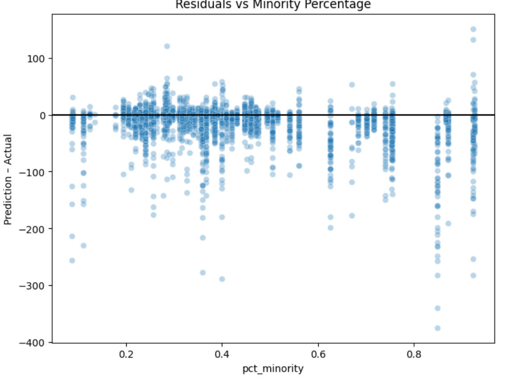
  <figcaption>Negative trend: Higher-minority routes experience greater underprediction.</figcaption>
</figure>

### 3. Underserved Route Clusters Identified

K-means clustering of 135 routes revealed **6 distinct groups**. The most underserved cluster:

**Cluster 1 (16 routes)**: 8, 14, 17, 19, 26, 29, 41, 42, 43, 44, 45, 47, 55, 112, 114, 171

| Metric | Value | Interpretation |
|--------|-------|----------------|
| Poverty | +1.4 SD | Highest poverty neighborhoods |
| Minority % | +1.1 SD | High minority population |
| Transit Dependence | +1.2 SD | High zero-vehicle households |
| **Reliability** | **-1.1 SD** | **Worst service quality** |

These routes serve Roxbury, Dorchester, Mattapan, Hyde Park, Chelsea, and Everett.

<figure style="text-align:center;">
  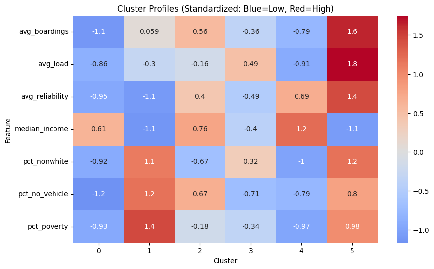
  <figcaption>Cluster profiles: Red = above average, Blue = below average.</figcaption>
</figure>

### 4. Income Predicts Service Quality

Reliability modeling revealed **neighborhood income is a top predictor** of service quality. Routes serving wealthier areas consistently exhibit higher reliability, even controlling for operational factors.

<figure style="text-align:center;">
  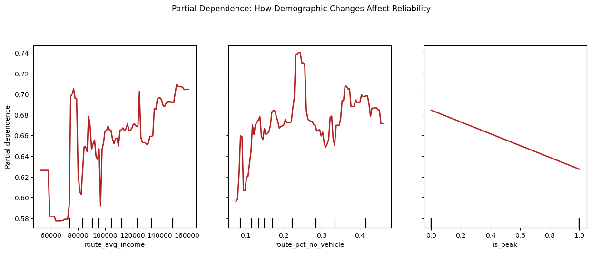
  <figcaption>Partial dependence: Higher income correlates with higher reliability.</figcaption>
</figure>

### 5. The Equity Paradox

Some high-minority routes (Cluster 5: flagship "Key Bus Routes") receive **excellent** service, while most neighborhood routes serving similar demographics (Cluster 1) receive the **worst**. This suggests MBTA investment is **selective rather than systematically equitable**.

---

## **Predictive Modeling Methods** (Midterm Report): predictve_ridership.ipynb

Built a baseline ridership forecasting model, using:

- Model Type: Random Forest Regressor (why? handles nonlinear patterns, robust to noise as opposed to single decsiion tree)
- Features: route_id, hour, day_type_name, season, year
- Target: boardings (aggregate per route-hour-season-year)
- Preprocessing: OneHot encoding of categorical variables (used Pipeline + ColumnTransformer in SKlearn)
- Train/Test Split: Chronological split → Train = 2016–2021, Test = 2022–2024

**Key Insights:**
- Ridership is highly predictable using only temporal + route features.
- The model generalizes well to post-pandemic years.
- MAE: 40.011344986012304
- R²: 0.7489096543835372

<figure style="text-align:center;">
  
</figure>

<figure style="text-align:center;">
  
</figure>


---

**New Modeling- Ridership Forecasting with Demographics + Equity Analysis (equity.ipynb)**
Goal: Improve forecast accuracy and test whether errors are systematically related to demographic characteristics of riders.

Added Features (route-level survey percentages):
pct_minority, pct_low_income, pct_zero_vehicle, pct_limited_english, pct_youth, pct_senior

Model: RandomForestRegressor (same pipeline structure; demographics added as numeric features)

Results (test):
- MAE ≈ 20.38
- R² ≈ 0.92
<figure style="text-align:center;">
  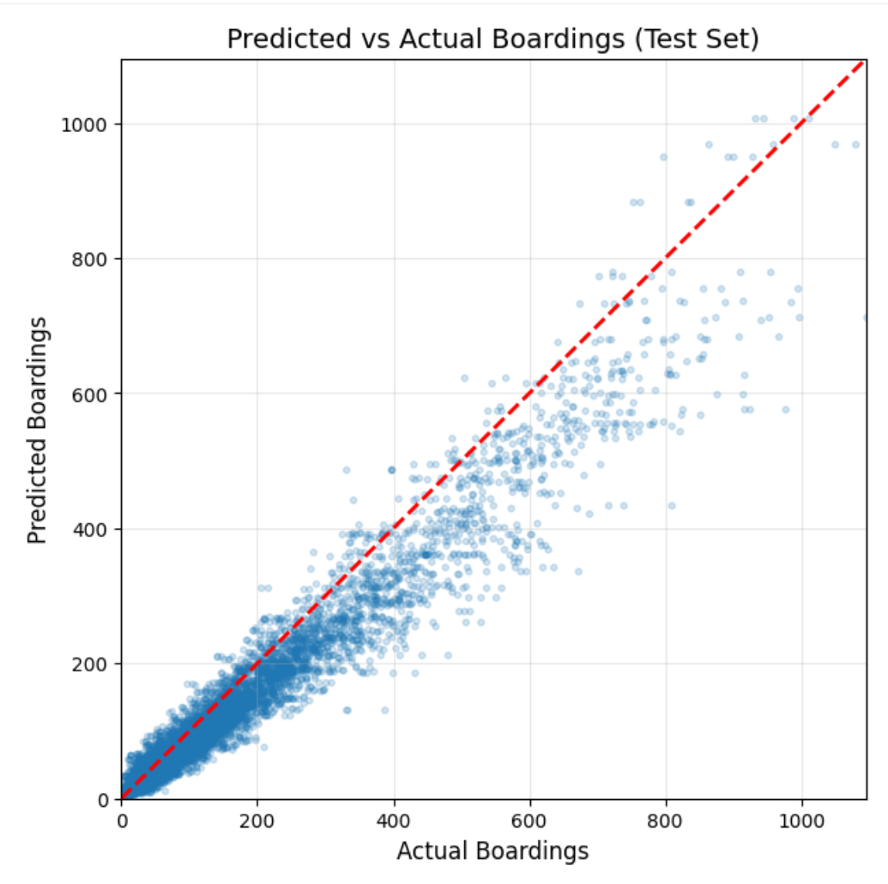
</figure>

This indicates that demographic variables capture additional structure in ridership patterns (especially across post-pandemic years), beyond time + route alone.

---

**Equity / Error Analysis**
After predicting on the test set, I compute residuals:
- residual = predicted − actual
- residual < 0 → underprediction

I then evaluate whether residuals trend with demographics (like pct_minority). A negative trend indicates underprediction for higher-minority routes--otherwise the residuals would be pretty uniform.

<figure style="text-align:center;">
  
  <figcaption>Residuals vs percent minority on test set. Negative trends indicate underprediction on higher-minority routes.</figcaption>
</figure>

<figure style="text-align:center;">
  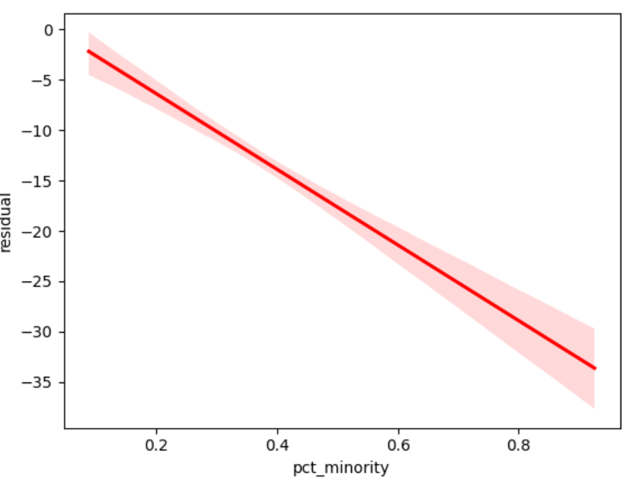
  <figcaption>Residuals vs percent minority on test set. Negative trends indicate underprediction on higher-minority routes.</figcaption>
</figure>

<figure style="text-align:center;">
  
  <figcaption>Residuals vs percent minority on test set. Negative trends indicate underprediction on higher-minority routes.</figcaption>
</figure>

---

**Fairness-Style Classifier (Error Predictability)**
To test whether underprediction is systematic rather than random, I train a classifier to predict whether an observation is underpredicted, using demographics as inputs.

- Label: underpredicted (based on residual threshold)
- Model: Logistic Regression (interpretable)
- Evaluation: ROC-AUC

Result: ROC-AUC ≈ 0.84
<figure style="text-align:center;">
  
</figure>

This suggests underprediction is predictable from demographics, meaning model errors are structured and associated with rider demographics.

What We Learned:
Baseline forecasting works: route + time features predict ridership well (R² ~ 0.75).

Demographics improve predictions substantially (R² ~ 0.92), suggesting ridership patterns are strongly tied to structural rider characteristics (car access, minority share, etc.).
Errors are not uniform: residual analysis indicates systematic underprediction on higher-minority routes.

Underprediction is predictable from demographic variables (AUC ~ 0.84), supporting the idea that errors are structured and equity-relevant.

---

**Limitations**

Demographics are from 2015–2017 and applied across 2016–2024. Post-COVID ridership composition may have shifted.
Demographics are route-level averages, not stop-level; within-route heterogeneity is not captured.

Ridership estimates include sampling noise and inconsistent coverage (sample_size/sample_count), which can affect both prediction and residual analysis.

This analysis is correlational, not really causal: demographic features may proxy other unobserved factors (service frequency, land use, employment patterns, there are many other factros).

---

## **Route Clustering Analysis: Identifying Underserved Routes**

Code: route_clustering.ipynb

**Goal**: Group MBTA bus routes by performance + demographics to identify which route clusters are systematically underserved.

### Methodology

**Data Integration:**
- Connected 2022 Census demographics to bus routes via spatial join (stops → census tracts → routes)
- Matched 6,806 / 6,890 stops (98.8% match rate) across 5 MA counties

**Features (7 total):**
- Performance: avg_boardings, avg_load, avg_reliability
- Demographics: median_income, pct_nonwhite, pct_no_vehicle, pct_poverty

**Clustering:**
- K-means with K=6 (determined via elbow method)
- 135 routes with complete data

### Key Findings

<figure style="text-align:center;">
  
  <figcaption>Cluster profiles: Red = above average, Blue = below average. Cluster 1 shows high poverty/minority but low reliability.</figcaption>
</figure>

**Cluster 1 (Underserved): 16 routes**
- Routes: 8, 14, 17, 19, 26, 29, 41, 42, 43, 44, 45, 47, 55, 112, 114, 171
- Neighborhoods: Roxbury, Dorchester, Mattapan, Hyde Park, Chelsea, Everett
- Profile: Highest poverty (+1.4 SD), high minority (+1.1 SD), high transit-dependence (+1.2 SD)
- Service: **WORST reliability (-1.1 SD)**

**Cluster 4 (Privileged): 29 routes**
- Profile: Highest income (+1.2 SD), low minority (-1.0 SD), low poverty (-0.97 SD)
- Service: Good reliability (+0.69 SD) **despite low ridership (-0.79 SD)**

<figure style="text-align:center;">
  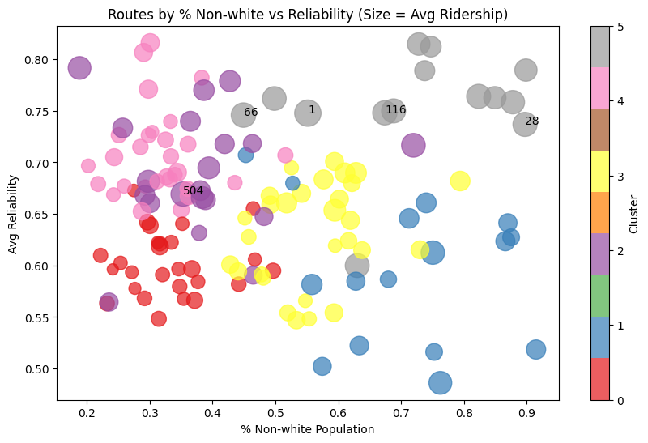
  <figcaption>Routes by % Non-white vs Reliability. Cluster 1 (underserved) appears in the lower-right quadrant.</figcaption>
</figure>

### The Equity Paradox

Clusters 1 and 5 serve **similar demographics** (high poverty, high minority) but receive opposite service:

| | Cluster 1 | Cluster 5 |
|--|-----------|-----------|
| Demographics | High poverty, high minority | High poverty, high minority |
| Reliability | -1.1 (worst) | +1.4 (best) |
| Route type | Neighborhood routes | Flagship "Key Bus Routes" |

**Interpretation**: MBTA investment appears selective—only flagship routes in disadvantaged areas get priority.

This clustering analysis establishes **ground truth** (what currently exists). Combined with our predictive modeling analysis:

| Analysis | Finding |
|----------|---------|
| **Clustering (this notebook)** | Minority communities currently receive worse service |
| **Predictive Modeling** | Models underestimate demand for minority communities |

**Combined interpretation**: The system both **underserves** and **undercounts** minority communities, creating a feedback loop that perpetuates inequity.


---


## **Reliability Data**

<h3><u>Data Processing:</u></h3>

The initial analysis was performed on the "MBTA Commuter Rail, Bus, Rapid Transit Reliability" dataset.

The goal of our processing was to isolate a clean, analysis-ready dataset focused specifically on bus service reliability for the period relevant to our project (2018-present).

In the context of this project, reliability is one of the most important metrics to determine service quality.

Reliability Metric: percentage of observed bus trips that were both on time (schedule adherence) and properly spaced (headway).

The following processing pipeline was executed:

- <u>Data loading</u>: The raw CSV data was loaded into a pandas DataFrame.
- Mode filtering: The dataset was filtered to retain only records where the mode_type was 'Bus'. All 'Rail' and 'Commuter Rail' data was discarded.
- Time filtering: The data was filtered to include only records where the service_date was on or after January 1, 2018, establishing our pre- and post-pandemic analysis window.
- Handling missing values:
  - ‘cancelled_numerator’: Null (NaN) values in this column were filled with 0, based on the assumption that a missing value indicates zero observed cancellations for that service block.
  - ‘otp_numerator / otp_denominator’: Rows with null values in either of these essential columns were dropped, as reliability cannot be calculated without them.
- <u>Feature Engineering (Reliability Metric)</u>: The primary dependent variable, reliability_metric, was engineered by dividing otp_numerator by otp_denominator.

This metric represents the percentage of observed bus trips that met service standards.

This metric serves as our primary proxy for service quality and the inverse of delay risk.

The resulting cleaned dataset contains a daily reliability score for each unique bus route (gtfs_route_short_name) and service period (peak_offpeak_ind).

<h3><u>Preliminary Visualizations</u></h3>

We produced a system-wide reliability time series.

This plot shows average reliability across all bus routes, aggregated monthly.

The plot displays two lines: one for 'PEAK' (weekday rush hour) and one for 'OFF_PEAK' (all other times).

A vertical red line marks the start of the COVID-19 pandemic in March 2020.

<figure style="text-align:center;"></figure>

<figure style="text-align:center;"></figure>

Key insights:

- Infrastructure is a decisive factor, the top performing routes, such as the SL2 and SL5, are Bus Rapid Transit (BRT) routes that operate in dedicated, bus only lanes. Their high performance is not random but a direct result of infrastructure that physically separates them from car traffic.
- The performance gap between PEAK and OFF_PEAK is minimal or non-existent. This is a critical finding, giving us hints that with proper infrastructure, it is possible to run a highly reliable bus service even during rush hour.
- Unlike the system-wide plot, these top performing routes showed almost no change in reliability after the March 2020 pandemic line. Their performance was already high and remained high, proving they are largely decoupled from the traffic congestion that plagues other routes.

Phase 2: Modeling & Equity Analysis

<h3><u>Modeling Strategy</u></h3>

We implemented a two-phased modeling approach to move from baseline prediction to equity analysis.

- Operational Model: Uses internal MBTA data (Route ID, Time, Season) to establish a performance baseline.
- Equity Model: Integrates external Census data to test if neighborhood demographics (Income, Vehicle Access) predict service reliability.

<h3><u>1. Operational Baseline & Risk Prediction</u></h3>

We trained a Random Forest Regressor to predict daily reliability scores and a Classifier to flag "High Risk" days (reliability < 70%).

Accuracy: The classifier achieved 76% accuracy in predicting service failure.

Key Driver: "Route Identity" was the dominant predictor, confirming that systemic route characteristics (length, infrastructure) outweigh temporal factors like seasonality.

<figure style="text-align:center;">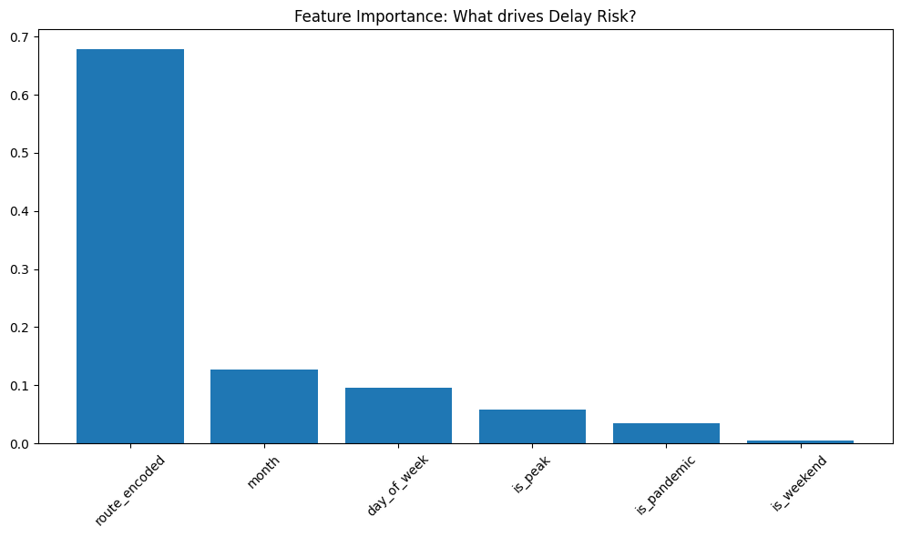<figcaption>Operational Feature Importance: Route identity outweighs seasonal factors.</figcaption></figure>

<figure style="text-align:center;">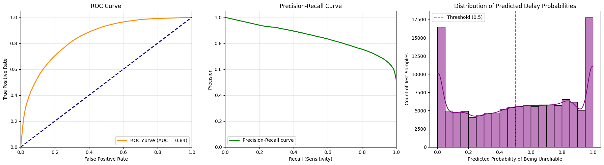<figcaption>Classification Dashboard: The model decisively separates reliable vs. unreliable service days.</figcaption></figure>

<h3><u>2. Geospatial & Equity Integration</u></h3>

To link service quality to communities, we built a geospatial pipeline using PATI Bus Stop data and MassGIS Census Tracts.

Spatial Join: Mapped 6,890 individual bus stops to Massachusetts Census Tracts with a 100% match rate.

Demographic Enrichment: Integrated ACS 5-Year Estimates to calculate route-level profiles for:

- Median Household Income (DP03)
- Vehicle Availability (DP04)
- Racial Composition (DP05) [Note: DP05 excluded from final model due to data quality issues]

<h3><u>3. Equity Model Results</u></h3>

The final Equity Model ($R^2 \approx 0.35$) revealed significant socioeconomic disparities in service quality.

<figure style="text-align:center;"><figcaption>R^2 Value for Equity Model based on Reliability Data</figcaption></figure>

Income is a Top Predictor: route_avg_income emerged as the single strongest predictor of reliability, often outweighing operational factors like "Peak Hour" status.

Direction of Bias: Partial Dependence Plots confirm a positive correlation: controlling for other factors, routes serving wealthier neighborhoods consistently exhibit higher reliability.

Density/Car Effect: Neighborhoods with lower car ownership also showed higher reliability, likely reflecting better service in dense, transit-rich urban cores compared to outlying suburbs.

<figure style="text-align:center;">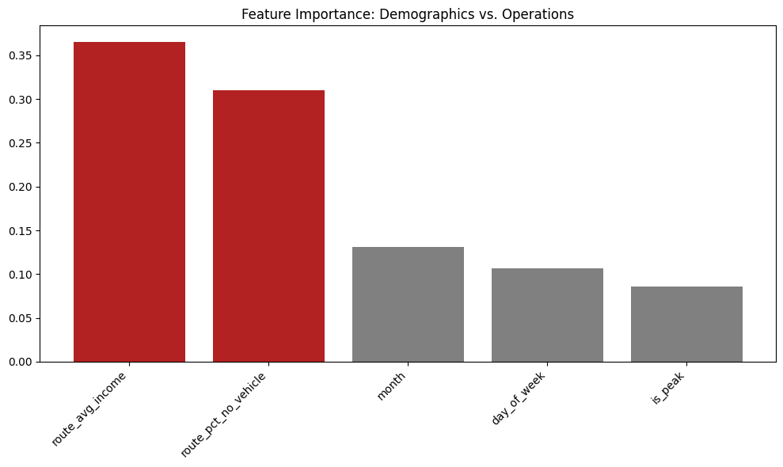<figcaption>Equity Analysis: Demographic features (Red) significantly impact reliability prediction.</figcaption></figure>

<figure style="text-align:center;"><figcaption>Partial Dependence: Higher neighborhood income correlates with higher modeled reliability.</figcaption></figure>

## **MBTA Bus Delay & Passenger Wait Time Analysis (2018–2024)**

Original code: https://github.com/avanc13/CS506Project/blob/main/notebooks/Average%20Delay/average_delay_improved_v2.ipynb

---

**Preliminary Visualizations:**

<h3><u>Average Bus Delay per Route by Year</u></h3>

Average delay was computed for each route-year combination to assess long-term reliability trends.

<figure style="text-align:center;">
  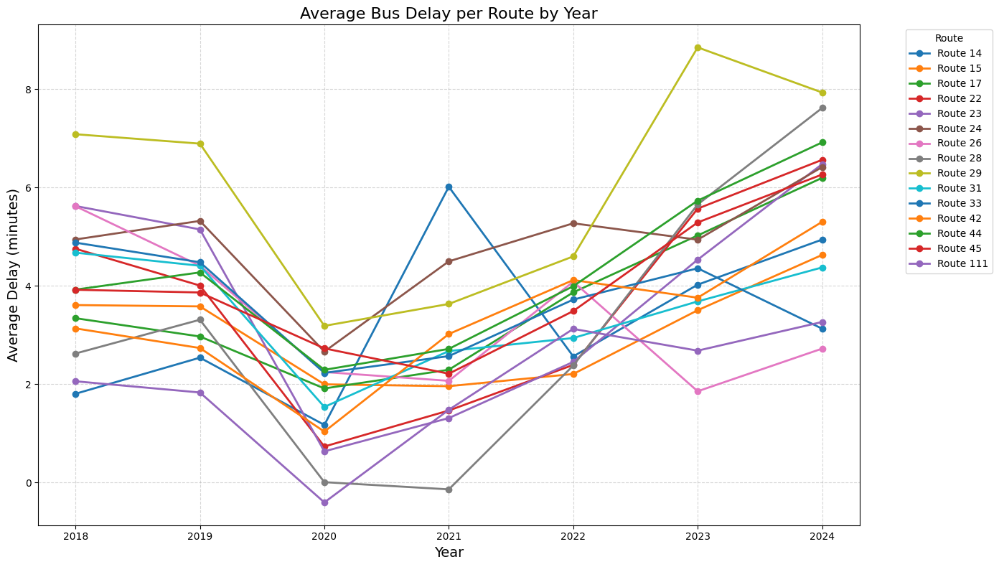
  <figcaption>Average delay by route and year visualized using target routes from the Livable Streets report.</figcaption>
</figure>

<h3><u>Heatmap: End-to-End Travel Time per Route</u></h3>

A heatmap visualization was created to show end-to-end travel time patterns across routes and years.

<figure style="text-align:center;">
  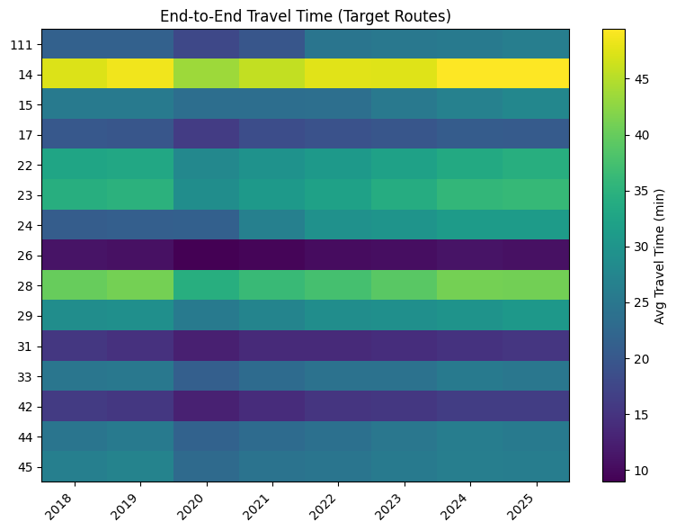
  <figcaption>The plot shows consistent travel times across the years observed, with route 14 having the longest of travel times end to end.</figcaption>
</figure>

<h3><u>Average Passenger Wait Time (On-Time vs. Delayed)</u></h3>
Passenger wait time was analyzed separately for on-time and delayed buses.

- On-time bus: Arrival within 5 minutes of the scheduled time
- Delayed bus: Arrival more than 5 minutes after the scheduled time

<figure style="text-align:center;">
  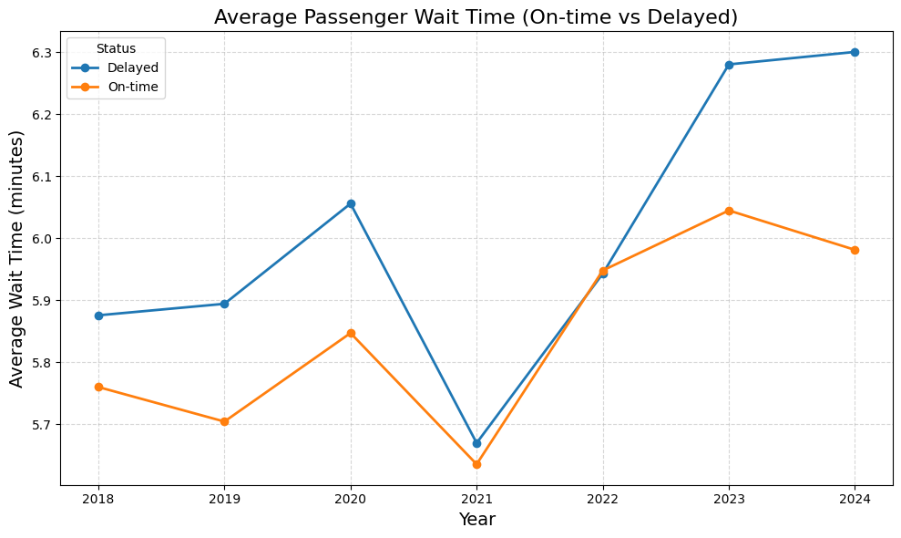
  <figcaption>The plot shows a decline in wait time across all routes post pandemic with a spike in delays calculated in 2024.</figcaption>
</figure>

---

**Next Steps**

We will expand from route-level ridership forecasting to stop-level equity analysis, incorporating service reliability and neighborhood demographics.

**Modeling Enhancements**

<h4><u>Classification Model: Random Forest</u></h4>
A Random Forest classifier was trained to predict whether a bus arrival would be on-time or delayed. Evaluation included:
- Confusion matrix analysis
- Accuracy, precision, recall, and error inspection

<figure style="text-align:center;">
  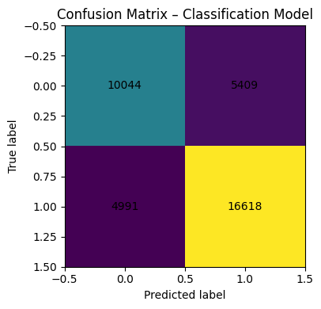
  <figcaption>Confusion matrix for the binary classification model predicting bus arrival status (on-time vs. delayed). The matrix summarizes correct and incorrect predictions across the test dataset, highlighting the model’s ability to distinguish between delayed and on-time bus arrivals.</figcaption>
</figure>

The classification model achieves an overall accuracy of 72%
- Class 0 (On-time buses):
  - Precision: 0.67
  - Recall: 0.65
  - F1-score: 0.66
  - The model correctly identifies a majority of on-time arrivals but occasionally misclassifies delayed buses as on-time, reflecting overlap in operational conditions near the delay threshold.
- Class 1 (Delayed buses):
  - Precision: 0.75
  - Recall: 0.77
  - F1-score: 0.76
  - Stronger performance is observed for delayed buses, suggesting the model is more effective at detecting delay-related patterns in the data.

The confusion matrix shows:
- 10,044 true on-time predictions
- 16,618 true delayed predictions
- 5,409 false positives (on-time predicted as delayed)
- 4,991 false negatives (delayed predicted as on-time)

---

**Regression Models**

Inputs (Features):
- Route ID
- Service year
- Scheduled headway
- Actual headway
- Time-based features derived from scheduled and actual arrival times
- Engineered operational features capturing route-level and temporal behavior

Output (Target):
- Bus delay duration (minutes) — a continuous value representing the difference between scheduled and actual arrival times

<h3><u>Linear Regression</u></h3>
- MAE ≈ 3.02
- R^2 score ≈ 0.29

The linear regression model yields an MAE of approximately 3.02 minutes, meaning that on average, predictions are about three minutes away from the actual delay value. The R² score of 0.29 indicates that the model explains roughly 29% of the variance in bus delays.

<h3><u>Gradient Boosting Regression</u></h3>
- MAE ≈ 2.95
- R^2 score ≈ 0.34

The gradient boosting regression model achieves a mean absolute error (MAE) of approximately 2.95 minutes, indicating improved predictive accuracy compared to the linear regression baseline. The R² score of 0.34 shows that the model explains roughly 34% of the variance in bus delay duration.

<h3><u>XGBoost Regression</u></h3>
- MAE ≈ 2.85
- R^2 score ≈ 0.36

The XGBoost regression model achieves the strongest performance among all evaluated models, with a mean absolute error (MAE) of approximately 2.85 minutes and an R² score of 0.36. This indicates that the model explains roughly 36% of the variance in bus delay duration.

<h3><u>Residual Plot: XGBoost Regression</u></h3>

<figure style="text-align:center;">
  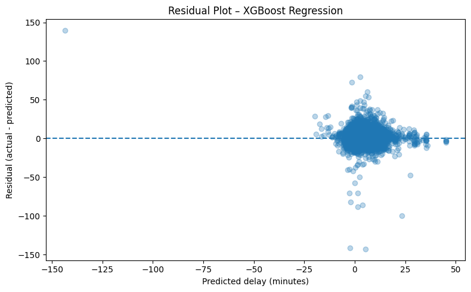
  <figcaption>Residuals are centered around zero with increasing variance for larger predicted delays, indicating reasonable fit with limitations for extreme cases.</figcaption>
</figure>

<figure style="text-align:center;">
  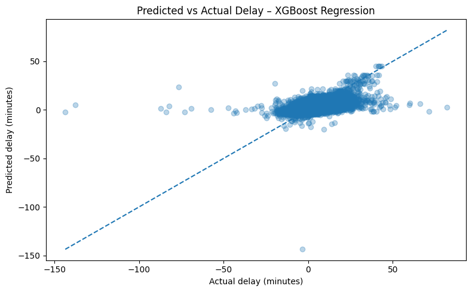
  <figcaption>Predictions closely track actual delays for typical conditions but diverge for extreme delays.</figcaption>
</figure>

<h4><u>Conclusion</u></h4>

While classification and regression models demonstrate reasonable performance for real-world transit data, the XGBoost regression model explains only about 36% of the variance in delay duration, reflecting the inherent difficulty of predicting bus delays. Many influential factors—such as traffic congestion, weather conditions, and operational disruptions—are not captured in the dataset and introduce significant unpredictability. Despite these limitations, the model achieves practical accuracy (MAE ≈ 2.85 minutes) and provides a scalable framework for analyzing and modeling public transit reliability.

